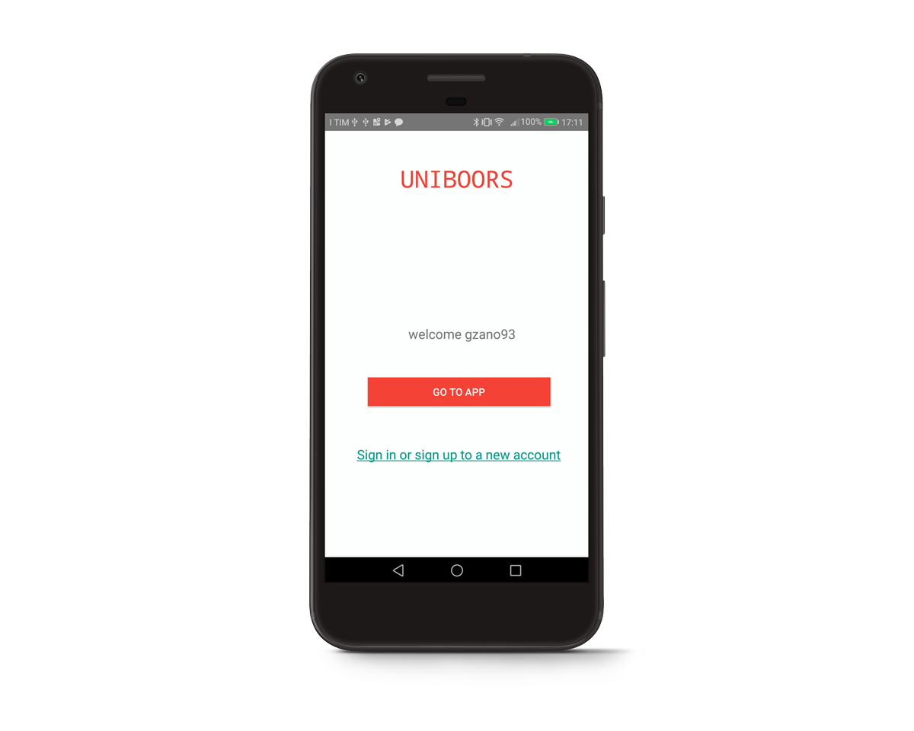
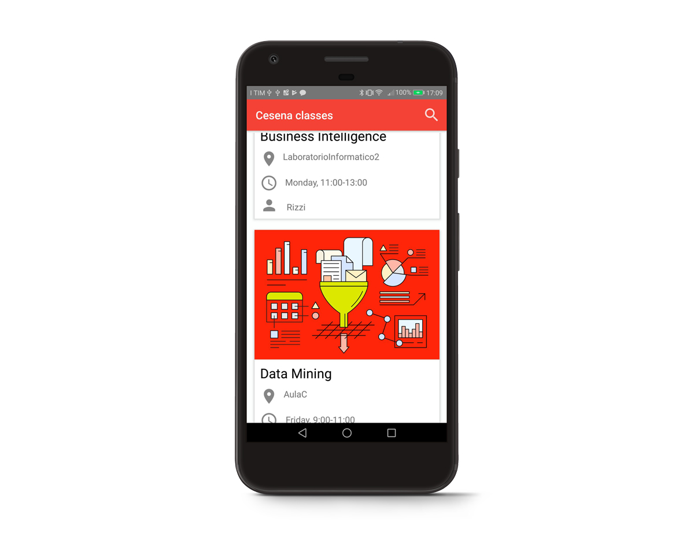
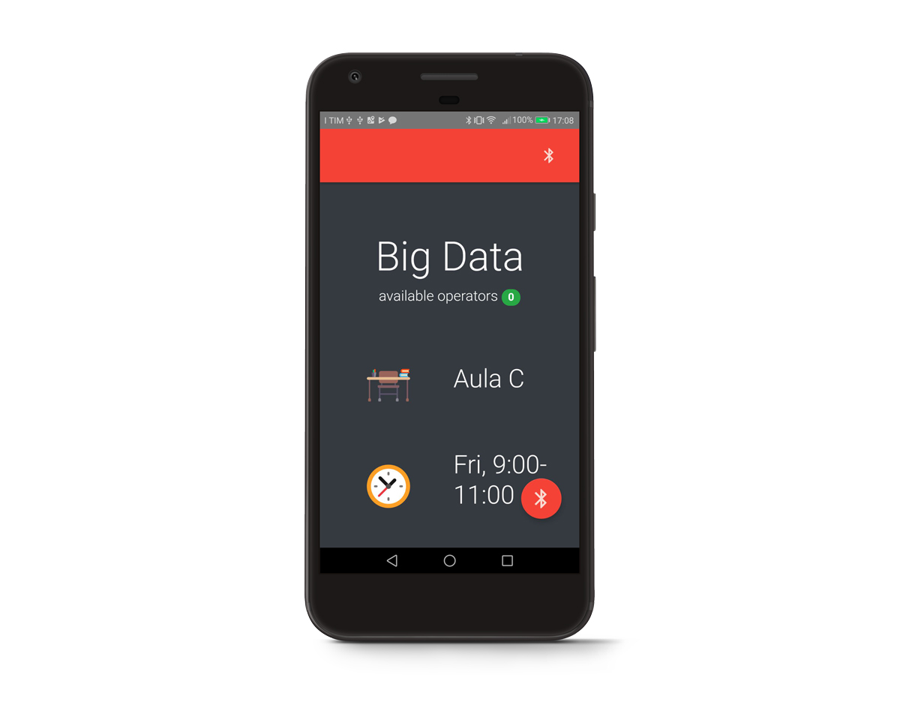
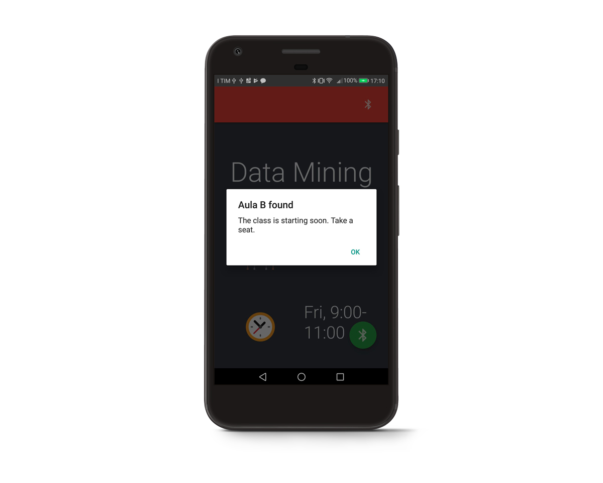

# Uniboors
App for indoors navigation in Cesena campus, University of Bologna.

Uniboors is the complementary mobile version of the project [UnIndoors](https://github.com/giacomobartoli/UnIndoors).

## Functionalities
- The user is able to login/signup to the system.
- The user is able to see its daily schedule of lessons.
- The user is able to see next week's lessons.
- The user can see all the details about a specific class (hour, teacher, subject, duration, place).
- The user can open an help request for reaching a certain room and visualize the status of the request.
- The user can use bluetooth navigation to be notified when the searched room is close to him/her.

## Stack of technologies
- Java 7
- Kotlin
- Javascript
- Firebase
- iBeacons (Android Beacon Library)

# Screenshots:

## Developers
Made with ❤️ by:

 - Giacomo Zanotti
 - Giacomo Bartoli

